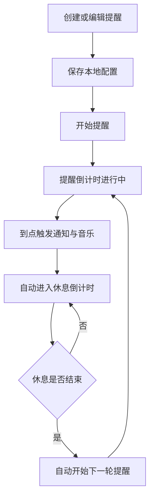
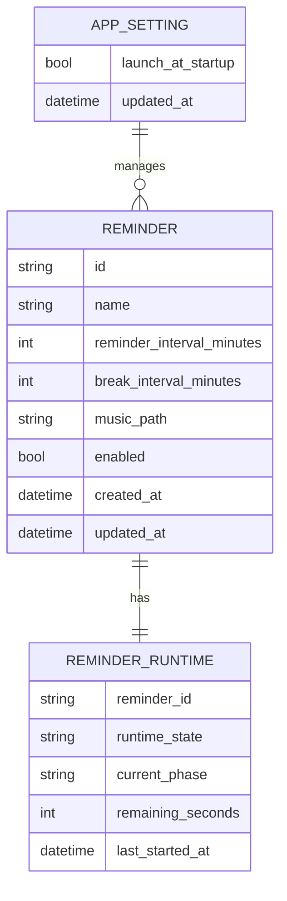
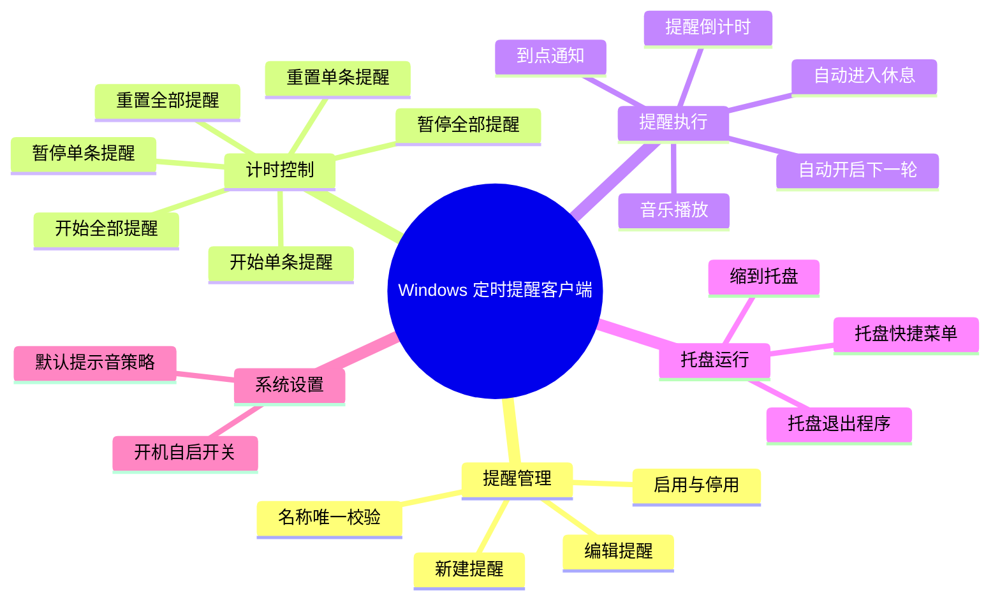

# Windows 定时提醒客户端 PRD

# 一、版本信息

| **文档版本** | **变更人** | **时间** | **主要变更内容** |
| -------- | ------- | ------ | ---------- |
| v0.1.5   | AI助手   | 2026-04-01 | 新增统一应用图标与打包图标规则 |
| v0.1.4   | AI助手   | 2026-04-01 | 新增 PyInstaller 单目录打包方案说明 |
| v0.1.3   | AI助手   | 2026-04-01 | 新增提醒删除功能与删除确认规则 |
| v0.1.2   | AI助手   | 2026-04-01 | 新增自动提醒设置与启动行为说明 |
| v0.1.1   | AI助手   | 2026-03-31 | 同步首期实现设计与技术选型 |
| v0.1.0   | AI助手   | 2026-03-31 | 创建 Windows 定时提醒客户端首版 PRD |

# 二、需求概述

## 需求背景

长时间久坐、忘记滴眼药水、忘记短暂休息，是高频且持续存在的个人健康提醒问题。用户通常依赖手机闹钟、便签或零散的番茄钟工具，但这些工具往往存在以下问题：

- 无法同时管理多条循环提醒
- 缺少“提醒间隔 + 休息间隔”的连续轮转机制
- 难以对单条提醒和全部提醒进行统一控制
- 关闭窗口后容易中断提醒
- 无法按个人偏好设置休息提醒

因此，需要提供一个仅面向 Windows 的轻量桌面客户端，用于持续运行和管理健康类周期提醒，帮助用户形成稳定的工作与休息节奏。

## 需求目标

本产品首期目标如下：

- 支持用户创建多个循环提醒，用于久坐提醒、滴眼药水提醒及其他自定义场景
- 支持设置提醒名称、提醒间隔、休息间隔和休息提醒
- 支持提醒自动轮转：提醒结束后自动进入休息，休息结束后自动进入下一轮提醒
- 支持单条提醒与全部提醒的一键开始、暂停、重置
- 支持创建后的编辑能力和本地持久化保存
- 支持关闭主窗口后缩到系统托盘继续运行
- 支持用户手动开启或关闭开机自启
- 支持在设置中开启自动提醒，启动后自动开始全部提醒并缩到托盘

## 用户画像

| **用户类型** | **典型特征** | **核心诉求** |
| -------- | -------- | -------- |
| 办公室久坐用户 | 长时间坐在电脑前办公 | 规律站立、走动、放松身体 |
| 电脑重度使用者 | 长时间盯屏、眼部疲劳 | 规律滴眼药水、远眺、闭眼休息 |
| 自律型效率用户 | 需要节奏化工作管理 | 用番茄式循环提醒维持节奏 |

## 方案说明

提供一个基于 `Qt6 + Python` 开发的 Windows 桌面客户端。用户可创建多条提醒任务，每条提醒独立维护自己的名称、提醒间隔、休息间隔、休息提醒和运行状态。程序支持单条提醒控制与全部提醒批量控制，支持本地持久化保存，支持托盘常驻运行。提醒达到设定间隔后，系统触发桌面提醒与音乐播放，并自动进入休息倒计时；休息结束后自动开始下一轮提醒。

## 用户故事

| **#** | **用户故事** | **验收标准** | **优先级** | **版本** |
| ----- | -------- | -------- | ------- | ------ |
| US-001 | 作为办公用户，我希望创建一个久坐提醒，以便按固定节奏起身活动。 | 可成功创建提醒并开始循环计时。 | P0 | v0.1.0 |
| US-002 | 作为用药用户，我希望创建一个滴眼药水提醒，以便不忘记按时用药。 | 可创建自定义提醒并按配置到点提醒。 | P0 | v0.1.0 |
| US-003 | 作为用户，我希望为提醒填写自定义名称，以便区分不同用途的提醒。 | 名称必填，保存时校验唯一。 | P0 | v0.1.0 |
| US-004 | 作为用户，我希望设置提醒间隔和休息间隔，以便形成符合自身习惯的循环节奏。 | 可保存两个间隔，运行时按顺序自动轮转。 | P0 | v0.1.0 |
| US-005 | 作为用户，我希望在创建后编辑提醒配置，以便随时调整节奏和提醒方式。 | 已创建提醒可编辑；若编辑运行中提醒，保存后按新配置重置并暂停。 | P0 | v0.1.0 |
| US-006 | 作为用户，我希望为提醒设置音乐，以便在提醒触发时更容易注意到。 | 可选择本地音频文件并在提醒时播放。 | P0 | v0.1.0 |
| US-007 | 作为用户，我希望单独开始、暂停、重置某个提醒，以便灵活控制不同提醒。 | 单条提醒支持开始、暂停、重置。 | P0 | v0.1.0 |
| US-008 | 作为用户，我希望一键开始、暂停、重置全部提醒，以便统一管理多个提醒。 | 全部提醒支持批量控制。 | P0 | v0.1.0 |
| US-009 | 作为用户，我希望关闭主窗口后程序缩到系统托盘继续运行，以便提醒不中断。 | 关闭主窗口后不退出，托盘仍可操作。 | P0 | v0.1.0 |
| US-010 | 作为用户，我希望下次打开客户端时保留已有提醒配置，以便无需重复创建。 | 重启客户端后提醒配置仍存在。 | P0 | v0.1.0 |
| US-011 | 作为用户，我希望在设置中手动开启开机自启，以便程序随系统启动自动运行。 | 默认关闭，用户手动开启后系统重启仍生效。 | P1 | v0.1.0 |
| US-012 | 作为用户，我希望在设置中开启自动提醒，以便每次启动程序后自动开始全部已启用提醒并缩到托盘。 | 默认关闭，开启后每次启动程序都会自动开始全部已启用提醒并驻留托盘。 | P1 | v0.1.2 |
| US-013 | 作为用户，我希望删除不再需要的提醒，以便保持提醒列表整洁。 | 删除前需二次确认，确认后该提醒立即从列表移除且不可恢复。 | P1 | v0.1.3 |

## 系统规划

| **阶段** | **目标** | **预计上线日期** | **实际上线日期** | **状态** |
| ------ | ------ | :--------- | :--------- | :-- |
| 第1阶段 | 完成提醒管理、循环计时、托盘运行、本地持久化、音乐提醒、开机自启设置 | 待定 | 待定 | 开发中 |

# 三、整体说明

## 全局规范

### 产品范围规范

| **规则项** | **要求** | **备注** |
| ------- | ---- | ---- |
| 平台范围 | 仅支持 Windows 桌面端 | 首期不支持 macOS、Linux |
| 技术方案 | Qt6 + Python | 当前首期采用 `PySide6 + SQLite + pytest` |
| 数据存储 | 本地持久化存储 | 首期不引入云同步 |
| 语言要求 | 界面与提示信息全部使用中文 | 错误提示、通知提示均需中文 |

### 提醒数据规则

| **规则项** | **要求** | **备注** |
| ------- | ---- | ---- |
| 提醒名称 | 必填，长度 1-50 个字符 | 去除首尾空格后校验 |
| 名称唯一 | 新增、编辑时均不允许与现有提醒重名 | 删除后名称可重新使用 |
| 提醒间隔 | 必填，单位为分钟，取值大于 0 | 用于进入“提醒中”倒计时 |
| 休息间隔 | 必填，单位为分钟，取值大于等于 0 | 允许配置为 0，表示提醒后立即进入下一轮提醒 |
| 休息提醒 | 可选 | 未设置时使用默认提示音 |
| 音乐文件 | 需为本地可访问文件 | 文件失效时回退默认提示音并提示用户 |

### 状态与控制规则

| **规则项** | **要求** | **备注** |
| ------- | ---- | ---- |
| 开始 | 从当前剩余时间继续运行 | 未启动或暂停状态均可开始，运行中的提醒由客户端每秒驱动倒计时 |
| 暂停 | 停止当前倒计时并保留剩余时间 | 不改变当前轮次类型 |
| 重置 | 恢复到提醒间隔初始值并停止运行 | 无论当前处于提醒轮次还是休息轮次，重置后统一变为未启动 |
| 到点处理 | 提醒倒计时结束后自动进入休息倒计时 | 同时触发 Qt 托盘通知与音频播放 |
| 休息结束 | 自动进入下一轮提醒倒计时 | 无需用户确认 |
| 全部开始 | 对全部可运行提醒执行开始 | 已运行中的提醒保持原状 |
| 全部暂停 | 对全部运行中提醒执行暂停 | 已暂停或未启动提醒保持原状 |
| 全部重置 | 对全部提醒执行重置 | 重置后统一处于未启动状态 |

### 托盘与窗口规则

| **规则项** | **要求** | **备注** |
| ------- | ---- | ---- |
| 关闭主窗口 | 默认缩到系统托盘，不退出程序 | 首次触发可考虑提示用户 |
| 托盘菜单 | 至少支持显示主窗口、开始全部、暂停全部、重置全部、退出程序 | 托盘菜单文案为中文，且图标与应用主图标一致 |
| 退出程序 | 仅通过托盘菜单或主界面明确退出操作触发 | 退出前统一重置全部提醒并保存配置 |

### 开机自启规则

| **规则项** | **要求** | **备注** |
| ------- | ---- | ---- |
| 默认值 | 默认关闭 | 用户手动开启 |
| 启用方式 | 在系统设置中通过开关启用 | 需立即写入本地配置并生效 |
| 启动行为 | 开机自启后，程序启动时默认最小化到系统托盘 | 不主动弹出主窗口 |

### 自动提醒规则

| **规则项** | **要求** | **备注** |
| ------- | ---- | ---- |
| 默认值 | 默认关闭 | 用户手动开启 |
| 启用方式 | 在系统设置中通过开关启用 | 需立即写入本地配置并生效 |
| 启动范围 | 每次启动程序都生效 | 不区分手动启动和开机自启启动 |
| 启动行为 | 自动开始全部已启用提醒并缩到托盘 | 托盘不可用时退化为开始全部提醒并显示主窗口 |

### 交互规则

| **规则项** | **要求** | **备注** |
| ------- | ---- | ---- |
| 消息提示 | 所有提示均为中文 | 包括保存成功、校验失败、异常提示 |
| 名称重复 | 阻止保存并提示“提醒名称已存在，请重新输入” | 适用于新增与编辑 |
| 提交中 | 按钮禁用，避免重复提交 | 表单保存时生效 |
| 表单校验失败 | 保留用户已输入内容 | 不清空表单 |
| 空值存储 | 可选项为空时按空值保存 | 例如休息提醒 |
| 编辑运行中提醒 | 保存后按新配置执行重置，并进入未启动状态 | 避免旧轮次与新配置混用 |

## 业务术语

| **类型** | **术语** | **说明** |
| ------ | ------ | :----- |
| 业务概念 | 提醒 | 一条独立的循环提醒任务 |
| 业务概念 | 提醒间隔 | 从开始计时到提醒触发的倒计时时长 |
| 业务概念 | 休息间隔 | 提醒触发后到下一轮提醒开始前的倒计时时长 |
| 业务概念 | 当前轮次 | 当前处于提醒轮次或休息轮次 |
| 系统概念 | 托盘运行 | 主窗口关闭后程序驻留在系统托盘继续工作 |
| 系统概念 | 开机自启 | 系统启动后自动拉起客户端并驻留托盘 |

## 权限设计

本产品为单机单用户桌面客户端，首期不设计多角色与权限体系。

## 流程说明



## 实体关系



## 数据结构

| 字段名 | 数据类型 | 必填 | 说明 |
| :-- | :--- | :- | :- |
| id | string | 是 | 提醒唯一标识 |
| name | string | 是 | 提醒名称，唯一 |
| reminder_interval_minutes | int | 是 | 提醒间隔，单位分钟 |
| break_interval_minutes | int | 是 | 休息间隔，单位分钟 |
| music_path | string | 否 | 本地音乐文件路径 |
| enabled | bool | 是 | 是否启用该提醒 |
| runtime_state | string | 是 | 运行状态，如未启动、提醒中、休息中、已暂停 |
| current_phase | string | 是 | 当前轮次，取值为 reminder 或 break |
| remaining_seconds | int | 是 | 当前轮次剩余秒数 |
| launch_at_startup | bool | 是 | 是否启用开机自启 |
| auto_remind_on_launch | bool | 是 | 是否启用自动提醒 |
| created_at | datetime | 是 | 创建时间 |
| updated_at | datetime | 是 | 更新时间 |

## 功能结构



## 功能清单

| **一级模块** | **二级模块** | **功能** | **功能描述** | **优先级** | **状态** | 用户故事ID |
| -------- | -------- | ------ | -------- | ------- | :----- | ------ |
| 提醒管理 | 提醒列表 | 查看提醒列表 | 展示提醒名称、间隔、状态、剩余时间 | P0 | 待开发 | US-001,US-002,US-003 |
| 提醒管理 | 新建提醒 | 创建提醒 | 支持录入名称、提醒间隔、休息间隔、音乐 | P0 | 待开发 | US-001,US-002,US-003,US-004,US-006 |
| 提醒管理 | 编辑提醒 | 编辑提醒配置 | 支持修改提醒名称、间隔、音乐等内容 | P0 | 待开发 | US-005 |
| 提醒管理 | 删除提醒 | 删除单条提醒 | 支持删除不再需要的提醒，删除前需二次确认 | P1 | 待开发 | US-013 |
| 计时控制 | 单条控制 | 开始、暂停、重置单条提醒 | 重置后回到当前轮次初始时长并暂停 | P0 | 待开发 | US-007 |
| 计时控制 | 批量控制 | 开始、暂停、重置全部提醒 | 一键控制全部提醒 | P0 | 待开发 | US-008 |
| 提醒执行 | 循环执行 | 自动提醒与自动休息轮转 | 到点自动休息，休息结束自动开始下一轮 | P0 | 待开发 | US-004,US-010 |
| 提醒执行 | 通知反馈 | 桌面通知与音乐提醒 | 支持默认音和自定义音乐 | P0 | 待开发 | US-006 |
| 托盘运行 | 托盘驻留 | 关闭主窗口缩到托盘 | 提醒持续运行不中断 | P0 | 待开发 | US-009 |
| 托盘运行 | 托盘菜单 | 快捷控制全部提醒及退出 | 支持常用操作 | P0 | 待开发 | US-008,US-009 |
| 系统设置 | 开机自启 | 手动开启或关闭自启 | 默认关闭，开启后托盘启动 | P1 | 待开发 | US-011 |
| 系统设置 | 自动提醒 | 启动后自动开始全部提醒并缩到托盘 | 默认关闭，开启后每次启动程序都生效 | P1 | 待开发 | US-012 |

## 状态说明

| **状态** | **前置条件** | **后置条件** | **备注** |
| ------ | -------- | -------- | ------ |
| 未启动 | 新建提醒或首次进入程序 | 可开始、可编辑 | 默认状态 |
| 提醒中 | 用户开始提醒或休息结束后自动进入下一轮 | 到点后自动切换到休息中 | 倒计时递减 |
| 休息中 | 提醒到点后自动进入 | 结束后自动切换到提醒中 | 倒计时递减 |
| 已暂停 | 提醒中或休息中执行暂停后进入 | 可继续开始、可编辑 | 保留当前剩余时间 |

## 整体布局

```text
+--------------------------------------------------------------+
| 顶部栏：应用名称 | 全部开始 | 全部暂停 | 全部重置 | 设置 |
+--------------------------------------------------------------+
| 提醒列表                                                     |
| +----------------------------------------------------------+ |
| | 名称 | 提醒间隔 | 休息间隔 | 当前状态 | 剩余时间 | 操作 | |
| | 久坐提醒 | 45分钟 | 5分钟 | 提醒中 | 00:12:30 | 开始/暂停/重置/编辑 | |
| | 滴眼药水 | 120分钟 | 1分钟 | 已暂停 | 01:30:00 | 开始/暂停/重置/编辑 | |
| +----------------------------------------------------------+ |
| [新建提醒]                                                   |
+--------------------------------------------------------------+
| 底部状态栏：托盘运行状态 | 本地存储状态 | 最近一次提醒时间             |
+--------------------------------------------------------------+
```

# 四、功能需求

## 模块名称：提醒列表主页

### 页面原型

```text
+------------------------------------------------------------------+
| Windows 定时提醒客户端                            [_] [□] [X]     |
+------------------------------------------------------------------+
| [新建提醒] [全部开始] [全部暂停] [全部重置]             [设置]     |
+------------------------------------------------------------------+
| 名称       | 提醒间隔 | 休息间隔 | 状态   | 剩余时间 | 操作        |
| 久坐提醒   | 45分钟   | 5分钟    | 提醒中 | 00:12:30 | 暂停 重置 编辑 |
| 滴眼药水   | 120分钟  | 1分钟    | 已暂停 | 01:30:00 | 开始 重置 编辑 |
+------------------------------------------------------------------+
| 关闭窗口后最小化到系统托盘继续运行                               |
+------------------------------------------------------------------+
```

### 页面说明

| **#** | **对象** | **说明** |
| ----- | ------ | ----------- |
| 1 | 页面作用说明 | 作为应用主界面，展示全部提醒及其状态，并提供统一控制入口 |
| 2 | 页面布局 | 顶部为全局操作区，中部为提醒列表区，右上角为窗口控制，底部为运行状态区 |
| 3 | 数据来源 | 本地持久化存储中的提醒配置与运行时状态 |

### 权限说明

| **#** | **角色** | **权限** |
| ----- | ------ | ------ |
| 1 | 本地用户 | 可查看、创建、编辑、控制本人客户端内的全部提醒 |

### 查询说明

| **#** | **对象** | **交互说明** | **逻辑说明** | **备注** |
| ----- | ------ | -------- | -------- | ------ |
| 1 | 提醒列表 | 首版默认不提供搜索过滤 | 启动时按创建时间或最近编辑时间加载全部提醒 | 后续可扩展 |

### 列表说明

描述列表字段及其功能。

| **#** | **对象** | **交互说明** | **逻辑说明** | **备注** |
| ----- | ------ | -------- | -------- | ------ |
| 1 | 名称 | 展示提醒名称 | 唯一标识一条提醒 | 不允许重名 |
| 2 | 提醒间隔 | 展示提醒轮次时长 | 单位分钟 | 只读展示 |
| 3 | 休息间隔 | 展示休息轮次时长 | 单位分钟 | 只读展示 |
| 4 | 状态 | 展示当前运行状态 | 未启动、提醒中、休息中、已暂停 | 实时刷新 |
| 5 | 剩余时间 | 展示当前轮次剩余时间 | 以 `HH:MM:SS` 显示 | 实时刷新 |
| 6 | 操作 | 开始、暂停、重置、编辑、删除 | 根据状态展示可用操作 | 删除前需二次确认 |

### 功能说明

| **#** | **对象** | **交互说明** | **逻辑说明** | **备注** |
| ----- | ------ | -------- | -------- | ------ |
| 1 | 新建提醒 | 点击后打开新建提醒弹窗 | 保存成功后回到列表并立即展示 | 名称需唯一 |
| 2 | 全部开始 | 点击后开始全部可运行提醒 | 已运行中提醒不重复开始 | 批量操作需提示结果 |
| 3 | 全部暂停 | 点击后暂停全部运行中提醒 | 保留各提醒剩余时间 | 批量操作 |
| 4 | 全部重置 | 点击后重置全部提醒 | 重置后全部进入未启动 | 批量操作 |
| 5 | 编辑 | 点击后打开编辑弹窗 | 保存后刷新列表与运行状态 | 若名称变更需再次校验唯一 |
| 6 | 关闭窗口 | 点击关闭按钮时不退出 | 缩到托盘继续运行 | 托盘可恢复窗口 |

### 状态说明

| **状态** | **前置条件** | **后置条件** | **备注** |
| ------ | -------- | -------- | ------ |
| 页面已加载 | 应用启动成功 | 可进行提醒管理与控制 | 首次启动时读取本地配置 |
| 托盘运行中 | 主窗口被关闭 | 程序继续在后台运行 | 可通过托盘恢复窗口 |

## 模块名称：新建与编辑提醒弹窗

### 页面原型

```text
+--------------------------------------+
| 新建提醒 / 编辑提醒                  |
+--------------------------------------+
| 名称：        [____________________] |
| 提醒间隔：    [ 45 ] 分钟            |
| 休息间隔：    [  5 ] 分钟            |
| 休息提醒：    [选择文件] [清空]      |
| 当前文件：    默认提示音 / 文件路径   |
| 启用状态：    [启用]                 |
+--------------------------------------+
|              [取消] [保存]           |
+--------------------------------------+
```

### 页面说明

| **#** | **对象** | **说明** |
| ----- | ------ | ----------- |
| 1 | 页面作用说明 | 用于创建新提醒或修改已有提醒 |
| 2 | 页面布局 | 表单区包含名称、间隔、音乐、启用状态，底部为操作按钮 |
| 3 | 数据来源 | 新建时为空白表单，编辑时回填本地已有配置 |

### 权限说明

| **#** | **角色** | **权限** |
| ----- | ------ | ------ |
| 1 | 本地用户 | 可新建与编辑提醒 |

### 查询说明

| **#** | **对象** | **交互说明** | **逻辑说明** | **备注** |
| ----- | ------ | -------- | -------- | ------ |
| 1 | 名称校验 | 点击保存时校验 | 去除首尾空格后判空并检查唯一性 | 校验失败不关闭弹窗 |
| 2 | 音乐文件 | 选择本地文件 | 保存前校验文件路径格式与可访问性 | 失效文件可后续回退默认音 |

### 列表说明

本模块无列表区域。

### 功能说明

| **#** | **对象** | **交互说明** | **逻辑说明** | **备注** |
| ----- | ------ | -------- | -------- | ------ |
| 1 | 名称输入 | 用户输入自定义提醒名称 | 必填，1-50 个字符，不允许重名 | 中文错误提示 |
| 2 | 提醒间隔输入 | 输入提醒分钟数 | 必填，大于 0 | 支持整数 |
| 3 | 休息间隔输入 | 输入休息分钟数 | 必填，大于等于 0 | 支持整数 |
| 4 | 休息提醒选择 | 选择本地音频文件 | 未设置时使用默认提示音 | 支持清空恢复默认 |
| 5 | 保存 | 点击后保存配置 | 新建写入本地，编辑覆盖原有记录；若目标提醒运行中，则按新配置重置并暂停 | 保存成功关闭弹窗 |
| 6 | 取消 | 点击后关闭弹窗 | 不保存当前修改 | 保留原数据 |

### 状态说明

| **状态** | **前置条件** | **后置条件** | **备注** |
| ------ | -------- | -------- | ------ |
| 编辑中 | 打开弹窗后进入 | 可保存或取消 | 表单可修改 |
| 保存成功 | 校验通过且写入成功 | 关闭弹窗并刷新主页 | 提示中文成功信息 |
| 保存失败 | 校验失败或写入异常 | 保留当前输入并提示错误 | 不关闭弹窗 |

## 模块名称：系统设置与托盘菜单

### 页面原型

```text
+----------------------------------+
| 系统设置                         |
+----------------------------------+
| [ ] 开机自启                     |
| 说明：开启后程序随 Windows 启动   |
| 行为：启动后默认最小化到托盘      |
+----------------------------------+
|            [关闭]                |
+----------------------------------+

托盘菜单：
- 显示主窗口
- 全部开始
- 全部暂停
- 全部重置
- 退出程序
```

### 页面说明

| **#** | **对象** | **说明** |
| ----- | ------ | ----------- |
| 1 | 页面作用说明 | 用于管理客户端级别设置和托盘快捷行为 |
| 2 | 页面布局 | 设置页首版包含开机自启与自动提醒开关，托盘菜单承载后台快捷操作 |
| 3 | 数据来源 | 本地应用设置 |

### 权限说明

| **#** | **角色** | **权限** |
| ----- | ------ | ------ |
| 1 | 本地用户 | 可修改系统设置，使用托盘菜单 |

### 查询说明

| **#** | **对象** | **交互说明** | **逻辑说明** | **备注** |
| ----- | ------ | -------- | -------- | ------ |
| 1 | 开机自启状态 | 打开设置时展示当前值 | 从本地应用设置读取 | 默认关闭 |
| 2 | 自动提醒状态 | 打开设置时展示当前值 | 从本地应用设置读取 | 默认关闭 |

### 列表说明

本模块无列表区域。

### 功能说明

| **#** | **对象** | **交互说明** | **逻辑说明** | **备注** |
| ----- | ------ | -------- | -------- | ------ |
| 1 | 开机自启开关 | 用户手动开启或关闭 | 修改后立即保存并尝试更新系统自启动配置 | 默认关闭 |
| 2 | 显示主窗口 | 从托盘菜单点击打开 | 恢复并聚焦主窗口 | 后台运行时可用 |
| 3 | 全部开始 | 从托盘菜单点击触发 | 等同主页的全部开始 | 快捷操作 |
| 4 | 全部暂停 | 从托盘菜单点击触发 | 等同主页的全部暂停 | 快捷操作 |
| 5 | 全部重置 | 从托盘菜单点击触发 | 等同主页的全部重置 | 快捷操作 |
| 6 | 退出程序 | 从托盘菜单点击触发 | 保存配置与状态后退出 | 与关闭窗口行为区分 |

### 状态说明

| **状态** | **前置条件** | **后置条件** | **备注** |
| ------ | -------- | -------- | ------ |
| 开机自启已关闭 | 默认状态或用户关闭后 | 下次系统启动不自动拉起程序 | 默认值 |
| 开机自启已开启 | 用户手动开启后 | 下次系统启动自动拉起程序并驻留托盘 | 首版 Windows 专用 |

# 五、非功能需求

## 退出恢复规则

- 关闭主窗口仅隐藏到托盘，不视为退出应用
- 明确执行退出程序时，全部提醒统一重置并暂停
- 下次启动只恢复提醒配置，不恢复退出前倒计时进度

## 数据埋点

首版不接入外部埋点平台，仅保留本地运行日志能力，至少记录以下事件：

- 提醒创建、编辑、开始、暂停、重置
- 提醒到点触发
- 休息结束自动进入下一轮
- 托盘启动与退出
- 开机自启开关变更

## 性能要求

| **指标项** | **要求** | **备注** |
| -------- | ---- | ---- |
| 启动耗时 | 常规环境下应用冷启动应尽量控制在 3 秒内 | 不含系统首次安装阶段 |
| 计时精度 | 单条提醒倒计时误差应控制在秒级可接受范围内 | 不要求毫秒级 |
| 本地保存 | 提醒配置变更后应立即持久化 | 防止异常退出丢失配置 |
| 托盘驻留稳定性 | 关闭主窗口后提醒仍应持续运行 | 不因界面关闭而中断 |
| 通知反馈 | 提醒到点时应有可感知通知 | 优先桌面通知 + 音乐 |

# 六、上线准备及检查

## 权限配置

本产品首版无业务权限配置要求。若启用开机自启，需具备 Windows 自启动配置写入权限。

## 图标规范

- 应用需提供统一品牌图标，覆盖主窗口左上角、系统托盘与打包后的 exe 图标
- 图标资源以 ico 为运行与打包主格式，保留 svg/png 作为设计源与预览图
- 首期图标风格采用健康提醒工具取向，保持简洁、清晰、易识别

## 打包与分发

- 首期提供 PyInstaller 单目录打包方案，用于生成 Windows 可分发目录版应用
- 打包产物包含主程序与运行依赖，不预置真实用户数据库
- 本地 SQLite 仍在应用首次运行后写入 LOCALAPPDATA\\ReminderClient\\reminder-client.db`r
- 用户自定义音频继续使用外部文件路径，不随应用一起打包

## 数据迁移

首版无需历史数据迁移。后续若调整本地存储结构，需补充版本化迁移策略。

## 种子数据

首版无需预置种子数据。可在产品演示环境中提供以下示例提醒：

- 久坐提醒：提醒间隔 45 分钟，休息间隔 5 分钟
- 滴眼药水：提醒间隔 120 分钟，休息间隔 1 分钟
